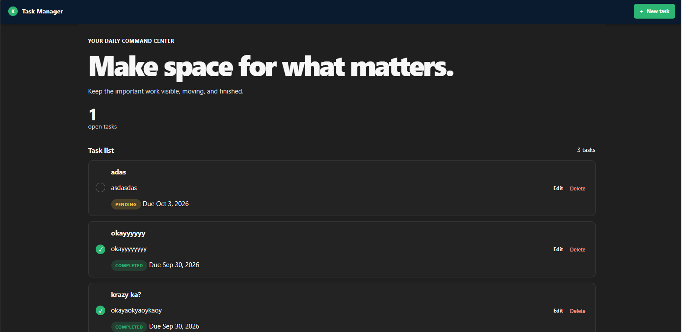
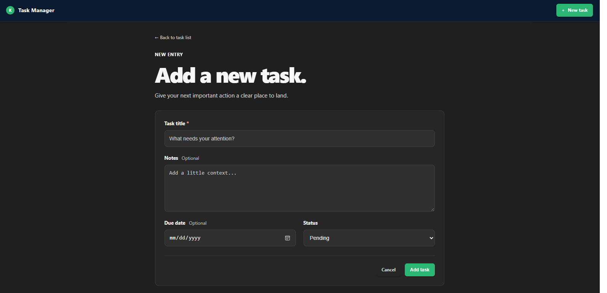
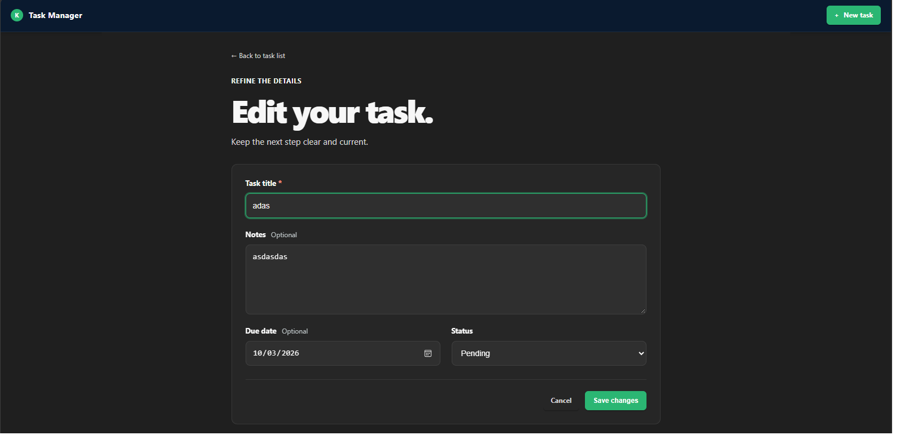
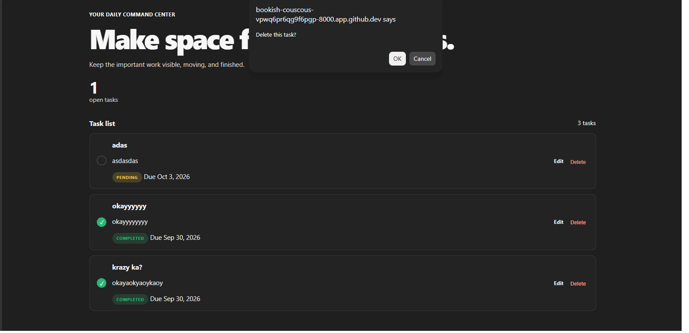

# Personal Task Manager

## Submission Information

- **Project Code:** WST21-PM-2026-SF
- **Student Name:** Kyle Lugod
- **Course & Year:** BSIT-2
- **Database Used:** SQLite

## Features

- Add Task
- View Tasks
- Edit Task
- Delete Task
- Update Status
  - Pending
  - Completed

## Technology Stack

- Laravel
- PHP
- SQLite
- Blade
- HTML and CSS

## Screenshots

### 1. Dashboard Overview



This screen shows the main dashboard of the Personal Task Manager. It displays the task summary, the number of open tasks, and the list of tasks with their status. The pending tasks are highlighted with a yellow badge, while completed tasks are marked with a green badge, giving users a clear view of their workload.

### 2. Add New Task Form



This screenshot shows the form used to create a new task. Users can enter the task title, optional notes, due date, and status before saving. This feature allows users to quickly add new responsibilities and keep track of upcoming deadlines.

### 3. Edit Task Form



This screen displays the edit task interface, where existing tasks can be updated. The form is pre-filled with the current task information so users can modify the title, notes, due date, or status without creating a duplicate entry. This helps keep task data accurate and up to date.

### 4. Delete Task Confirmation



This image shows the delete confirmation dialog that appears before removing a task. It prevents accidental deletion by asking the user to confirm their decision before the task is permanently removed from the list. This adds a safer and more user-friendly workflow.

## Running the Project

```bash
composer install
cp .env.example .env
php artisan key:generate
php artisan migrate
php artisan serve
```

Open the application at `http://localhost:8000` or use the forwarded port URL provided by VS Code.
